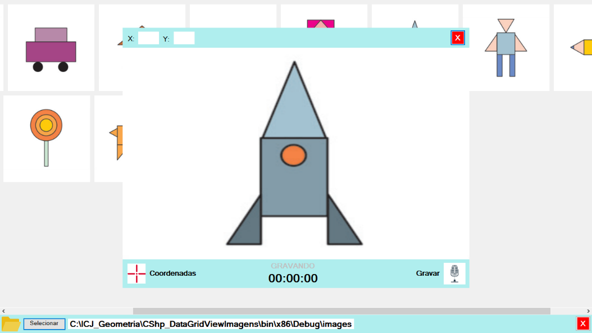
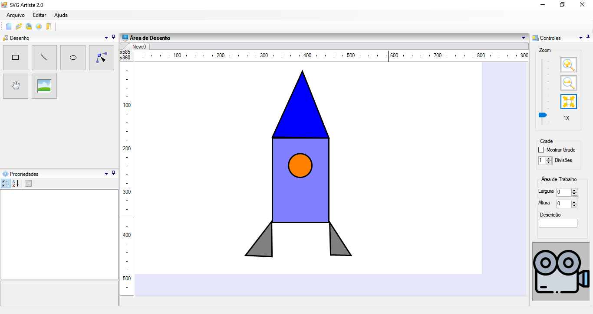
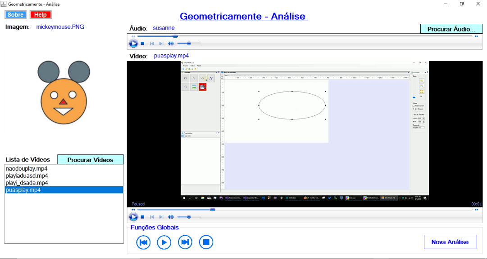

# O Projeto
Este é o repositório do software de captura de áudio (mp3) e vídeo (mp4) baseado no "Jogo das Figuras", o "GeometricaMente". É parte do projeto de Iniciação Científica Júnior (Ensino Médio) "Software para ensino de geometria para alunos dos anos iniciais do ensino fundamental", iniciado em 2018 junto ao Departamento de Computação da Unesp-Bauru e o CTI-Unesp.
## Intefaces
### Tela de audiodescrição da figura

### Tela de desenho e captura de vídeo da tela

### Tela de menu do software de análise

## Cartaz de apresentação do projeto
https://drive.google.com/file/d/12u9_pcq7-wyRL-w6VGvIN7Q3C1fBOfD-/view
